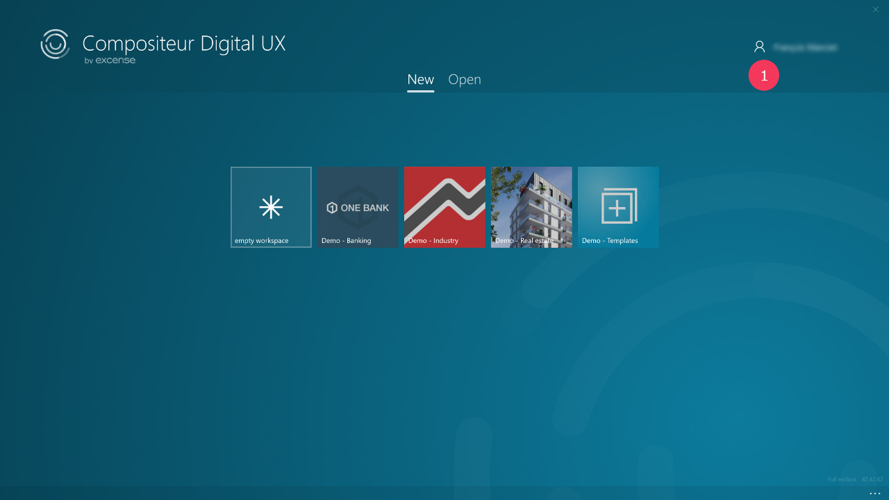
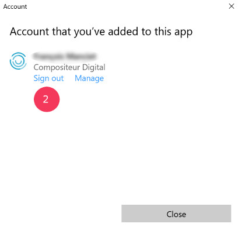
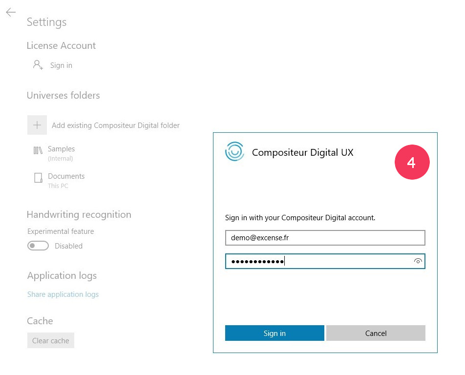
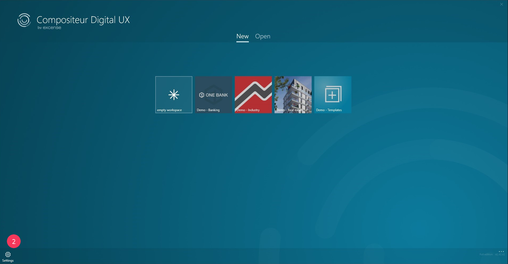
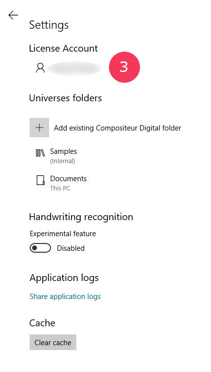
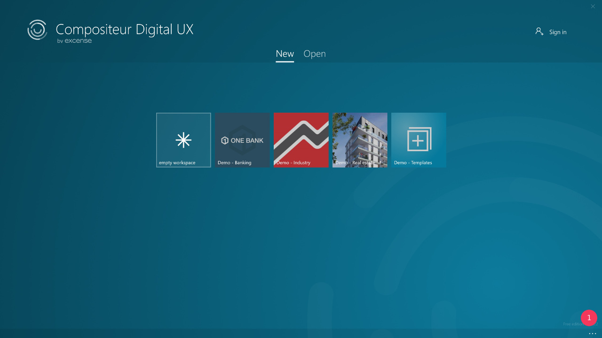
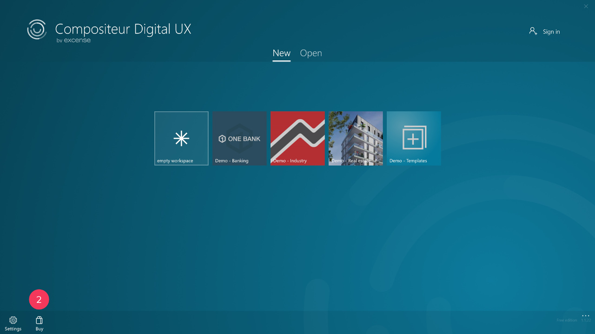

# Documentation

## Getting started

### Prerequisites

1. Multitouch enabled PC.
1. Windows 10 Creators Update (10.0, Build 15063) or later.

*How can I know which Windows 10 version I am using?*

1. Hit the "Search Windows" button (looks like a magnifying glass).
1. Enter `winver`.
1. Click on first item, labelled "Run Command".
1. Your Windows version appears.

### Download Compositeur Digital UX

1. [Open Compositeur Digital UX windows store page.](https://www.microsoft.com/en-gb/store/p/compositeur-digital-ux/9p201mgz4jb5?rtc=1)
1. Click on `Get the app`.
1. (Optional) Depending on your web browser, you'll be asked to launch the Microsoft Store. Click on `Open Microsoft Store`  or `Allow`.
1. On the store page, click on `Install`.
1. Once the installation is completed, click on `Launch`.

### [Use your Compositeur Digital UX account](createanCompositeurDigitalUXaccount.md)

Compositeur Digital UX offers a free version which allows you to use a limited set of the features offered by Compositeur Digital UX.

To overcome this limitation, if you already have a Compositeur Digital account, you can use this account to connect to Compositeur Digital UX.

If you don't have an account, [feel free to create one!](http://www.compositeurdigital.com/Account/Register) Once your account has been created and validated, use it in Compositeur Digital UX.

#### Case 1: I am using a laptop

1. On the app start page, click on `Sign in`.
1. Enter your username and password.
1. You're connected!

At any time, you can freely decide to sign out.

1. On the app start page, click on your name
2. Click on `Sign out`.

##### Case 2: I am using a shared device (e.g. Microsoft Surface Hub)

1. On the app start page, click on the `...` at the bottom right corner of the page.
1. Click on the `Settings` button.
1. On the settings page, click on `Sign in`.
1. Enter your username and password.
1. You're connected! 

**Note** : The device will remember you, and when you'll start a new session on your device, Compositeur Digital UX will use your account.

At any time, you can freely decide to sign out.

{:width="60%"}

1. On the app start page, click on the `...` at the bottom right corner of the page.
1. Click on the `Settings` button.
1. On the settings page, click on `Sign out`.

### Purchase a Compositeur Digital UX license

#### In-app purchase

Compositeur Digital UX offers in-app purchase. If you decide to purchase the product, all the restrictions which come with the free version will be removed and you'll use an unlimited version of Compositeur Digital UX. 

1. On the app start page, click the `...` button at the bottom right corner of the page.
1. Click on the `Buy` button.
1. Follow the buying instructions.
1. Your purchase has been authorized, congratulations!

