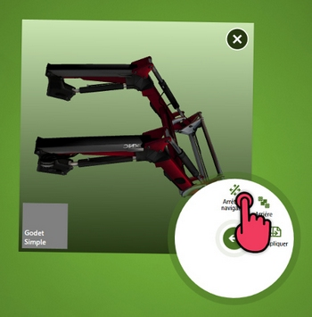

# Objet 3D

Utilisez ce type de contenu pour afficher un modèle 3D de produit, une maquette.

## Utilisation

Vous pouvez :

- Appuyer sur le bouton central pour activer la navigation 

- Orienter l'objet en glissant votre doigt sur le document
- Déplacer/Zoomer le document sans désactiver la navigation en utilisant 2 doigts
- Désactiver la navigation à l'aide du bouton présent dans le menu, afin de revenir à la manipulation "classique" des documents

## Administration

Extension de fichier : `obj`, `3ds`, `lwo`, `stl`, `u3d`, `pdf`*

### Objet avec plusieurs fichiers

Un fichier 3D peut référencer des fichiers associés (textures, etc.) Vous pouvez placer l'ensemble des fichiers dans un même dossier avec la même extension, par exemple :

Dans le cas ci-dessus on a placé un fichier au format `3ds` ainsi que ces textures associées dans un dossier que l'on a nommé `Chargeur 3D.3ds`.

### *Fichiers PDF 3D
Certains fichiers PDF peuvent contenir un objet 3D. Si vous souhaitez intégrer un tel objet dans le Compositeur Digital, placez le fichier pdf dans un répertoire portant l'extension `.u3d`.

### Affichage optionnel d'une partie d'un objet

Vous pouvez rendre visible ou invisible une partie d'un objet à la demande. Découpez pour cela votre objet 3D en plusieurs fichiers 3D que vous placez dans un même dossier, avec la même extension. Utilisez au besoin une numérotation pour forcer l'ordre des fichiers : le premier fichier 3D sera affiché à l'ouverture, les autres seront affichés dynamiquement à l'aide de boutons dans le Compositeur Digital.

Pour chaque fichier supplémentaire un bouton apparaîtra pour permettre de l'afficher

 

### Performances

Les performances d'affichage d'un objet 3D dépendent fortement de la complexité de son modèle et des performances du PC. L'objet 3D doit être relativement simple et optimisé pour un affichage temps-réel. Pour un affichage à 360° d'une scène complexe, de type photo-réaliste, vous pouvez utiliser les contenus de type [Objet 360°](sequence.md)

[Revenir au différents Types de contenus](content_types.md)