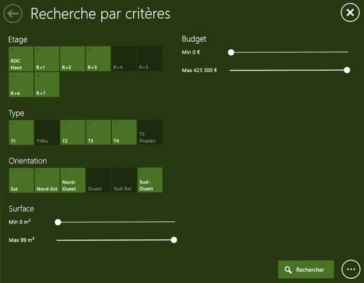
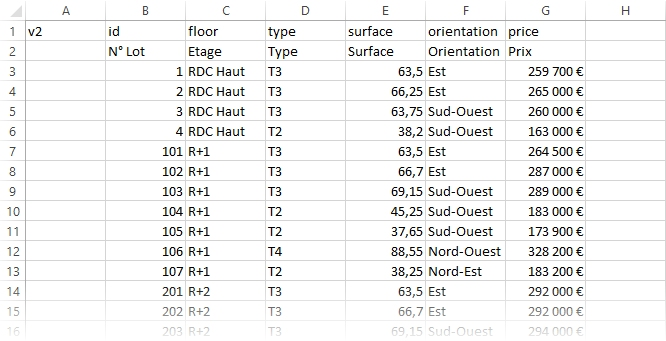

# Real estate - Apartment seach panel

This feature displays a search interface to look up for real estate products (e.g. apartments).

## Interaction in the Compositeur Digital

On this seach panel you can:
- Choose your search criteria: surface, pric, room count, etc.
- Start a search with your criteria
- Open the result in Compositeur Digital (e.g. floor plan)

## Content Management

- Folder extension: `apartments`
- Expected file in the folder: `_list.csv` 

The folder contains:
- All content refering to the offers (typically floor plans of the apartments).
- A spreadsheet containing the set of date that will be used for search criteria. This document is a CSV file (using `;` as delimiter) editable with spreadsheet software such as Microsoft Excel.

Here is the table that gives the output displayed above:

### Table format

- 1st line: criteria type
- 2nd line: criteria name
- following lines: one per offer

### Criteria types

- `id`: This column is mandatory and must match with a document name in the folder. It will not be displayed as a criteria but will be used to open a result.
- `floor`: floor level.
- `type`: number of rooms
- `surface`: surface of the product. Type in the value in sq.m (do no specifiy unit).
- `price`: Price. Multiple prices columns can be defined.
- `multiple`: criteria for multiple selection 
- `single`:  criteria to force a single choice .
