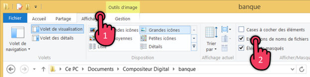
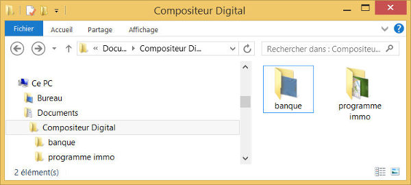
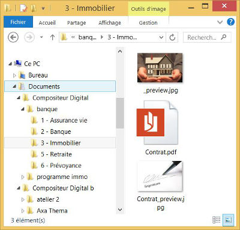
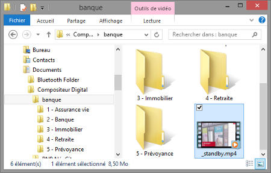

# Content management

The Compositeur Digital reads documents stored on your computer. Those documents can to be organized in folders to facilite the presentation

## Required skills and resources

The preparation of an environnement is done using the Windows built-in file explorer application

You should be confortable with : 

- Organizing folders 
- Renaming files and folder
- That's all :)

### File extensions

The Compositeur Digital processes the file extension to setup the various elements of an environment.  The `file extension` indicating the type of document is usually 3 to 4 characters following the dot in the file name :

- Images : photo1.jpg, photo2.png
- Presentation : pres1.pptx, pres2.pdf
- Text file : table of content.txt

By default the Windows File explorer application hides file extensions. We strongly recommend to change this setting:

## Environment

The Compositeur Digital can be use for multiple purposes

Real estate

Banking services

Technically an environment is materialized as folder on your computer. By default the Compositeur Digital will look for folders located in `Documents\Compositeur Digital`

To create your own environment, you can start by dublicating an exisiting one in the default location: `Documents\Compositeur Digital`.

## Background

You can customize your environment by changing the background image. To do so, simply add an image file named `_background` with the environment folder as described below:

## Folders

You can organize your documents in folders and sub-folders in an environment

The first level of folder is displayed in the Compositeur Digital in the dock located at the bottom of the environment view : 

>###  Hidden folders
>
>Folders using a '.content' extension will not be seen in Compositeur Digital. 
>See [interactive slideshow](slideshow#interactive) to see the common use of this feature.

## Documents

Simply drag and drop your documents in the folders and sub-folders to populate your environment.

Check [Supported content](content_types.md) for an exhaustive list of supported file types.

## Display order

The Compositeur Digital will display folders and documents using an alphabetical order. You can however force a specific order for documents and folders by prefixing the names with a number. The Compositeur Digital will not display the numbers but will arrange the items accordingly.

>Note : If you ever need to display a file with a name starting with a number (e.g. `3D render`) please refer to the [Advanced configuration](config#configuration_dun_document) section.

## Thumbnails 

The Compositeur Digital will automatically create thumbnails for all documents. You can customize thumbnails for all documents or folders of your environment.

### Folder thumbnails

If a thumbnail image has not been defined for a folder or document the Compositeur Digital will auto-create thumbnail image based on the first document located the folder:

 

To create a thumbnail for a folder simply drop an image file named `_preview` (.png or .jpg) directly in the folder:

 

### Document thumbnail

To customize the thumbnail image of a document, drag and drop an image file using the same name but suffixed with `_preview` in the same folder:

## Standby video

When the Kiosk mode of the Compositeur Digital is activated, a fullscreen video can be automatically stard after a specified period of inactivity. The video will loop until the touch screen is activated.

Place a supported video file named `_standby` in the environment folder:

 

All [supported video types](video.md) are supported.
