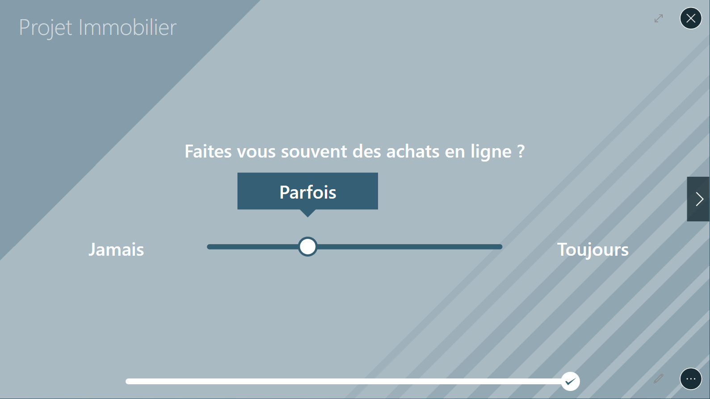

# Quiz

Use this type of content to guide the discussion through a series of questions and save the answers.

## Interaction in the Compositeur Digital

You can navigate to the previous and next page using the `<` and `>` arrows.
Depending on the type of page you can:
 - check or uncheck a value
 - select a numeric value using a slider
 - fill in text boxes
 - open a specific document

## Content management

- Folder extension: `quiz`

The quiz folder contains:

- Optional `_background` image file to customize the quiz 
- Optional documents required for the quiz
- A `_meta` folder containing all images required for the quiz
- a configuration file: `_questions.xml`

The configuration file specifies the quiz page by page. It is formatted in XML and can be edited using Notepad or another text editing application.


### Configuration file structure

The Quiz file contains two parts:  `sections` and `pages`.
Generic file structure:
```xml
<quizz>
    <sections>
        list of sections
    </sections>
    <pages>
        list of pages
    </pages>
</quizz>
```

Each pages will represent a question. Sections let you group pages that have the same section name. 

### Sections
Set the section display name in a `section` tag and optionnaly use the attribute `id` to use it as a reference.

```xml
<section id="intro">1. INTRODUCTION</section>
```

### Pages
You can add different page types to a quiz but all pages should have the following items in common:
 - a `sectionId` attribute that assigns a page to a section. The section name will appear on top of the page.
 - an optional `id` attribute to be used as an identifier if a reference to that page is needed. 
 - a `nextPageId` attribute: optional reference to the page that shoud be displayed next. If not set, the following page described in the file will be used. 

### 
The first page described in the list will always be the first page displayed.
The last page described will be by default the last displayed page.
To force a page to finish the quiz, set the `nextPageId` attribute value to `@end`.

### Page types
#### `questionPage`
This page type lets you create a question with a list of possible answers. Please note that an answer must be selected before going to the next page.

Here are the attributes for `questionPage`:
 - `label`: Question type. Superseeds the `visual` attribute.
 - `visual`: name of the question image file (without extension). The file must exist in the `_meta` folder.
 - `allowMultiple`: set to `true` to allow the selection of multiple answer.

The content of the `questionPage` is the list of answers, which can be of various types:
 - texted answers, with the tag `answer`:
 ```xml
 <answer>my answer</answer>
 ```
 - visual answers, with the tag `imageAnswer`. Set attribute `visual` to the name of the image (without extension) in the `_meta` folder:
   ```xml
   <imageAnswer visual="image 2"/>
   ```
   optionally you can set a caption:
   ```xml
   <imageAnswer visual="image 2">my caption</imageAnswer>
   ```
It is not possible to mix text answers with visual answers.

Set the `nextPageId` attribute on an answer to jump to a specific page if the user selects that answer and create branches to your quiz:

```xml
<questionPage id="Q1" sectionId="section 2" label="To which aquestion do you wish to answer ?" >
	<answer>The next question</answer>
	<answer nextPageId="Q1">This one again</answer>
	<answer nextPageId="Q3">Skip one please</answer>
</questionPage>

<questionPage id="Q2" sectionId="section 3" label="The next question">
	...
</questionPage>	
	
<questionPage id="Q3" sectionId="section 3" label="The last question">
	...
</questionPage>
```


#### `page`
A simple page to display either text or an image:
 - `label`: text to display
 - `visual`: name of the image file to display (no extension, file present in `_meta` folder)

```xml
<page sectionId="intro" label="Ceci est un test"/>
```


#### `infoPage`
Display a simple form in which the user can type in some information. Add `info` tags with the `label` attribute.

```xml
<infoPage sectionId="intro" label="Please fill out your identity">
	<info label="Name"/>
	<info label="Surname"/>
</infoPage>
```


To share this information with other documents and the profile info, use the `valueKey` attribute on an `info` tag (see [shared data](config#valueKeys)).


#### `numericSliderPage`
Displays a page with a single slider that lats users choose a bound numerical value:
 - `label`: question text. Takes precedence over `visual`.
 - `visual`: name of the image file to display (no extension, file present in `_meta` folder).
 - `min`: minimum selectable value
 - `max`: maximum selectable value
 - `minLabel`: (optional) : specific display value for the minimum value
 - `maxLabel`: (optional) : specific display value for the maximum value
 - `default`: (optional) preselected value
 - `stepSize`: difference between two steps of the cursor
 - `format`: changes the way the valuye is displayed

 Some possible formats are:
 - `N0`: rounded value
 - `C0`: rounded monetary value following the current locale (i.e. uses €, £, $, etc. where relevant)

```xml
<numericSliderPage id="funds" sectionId="section 3" label="Your available funds" min="0" max="5000000" stepSize="5000" format="C0" valueKey="finance.budget" />
```


To share this information with other documents and the profile info, use the `valueKey` attribute on an `info` tag (see [shared data](config#valueKeys)).

#### `labelSliderPage`
This displays a page with a scale selector in the form of a slider with a few fixed values.
- `label` : le titre ou la question à afficher.

Add `answer` tags to add scale values, the fisrt being the minimum and the last the maximum.

exemple :
```xml
<labelSliderPage sectionId="section1" label="Faites vous souvent des achats en ligne ?">
	<answer>Jamais</answer>
	<answer>Parfois</answer>
	<answer>Souvent</answer>
	<answer>Toujours</answer>
</labelSliderPage>
```



#### `imageSliderPage`
This page type offers the same functionality as the previous `labelSliderPage` but with the scale representing a cursor between to pictures rather than fixed values.
 - `label`: question text. Takes precedence over `visual`.
 - `visual`: name of the image file to display (no extension, file present in `_meta` folder).
 - `leftVisual`: picture to the left of the cursor.
 - `rightVisual`: picture to the right of the cursor.
 - `stepQuantity`: the nomber of selectable steps (recommended value: 10)

```xml
<imageSliderPage sectionId="part 1" label="What characterizes you most:" leftVisual="image1" rightVisual="image2" stepQuantity="10"/>
```


#### `documentPage`
Displays a link to open a document in Compositeur Digital.
- `label`: Title or question text.
- `document`: name of the document, which must exist in the quiz folder.

```xml
<documentPage label="Your documents:" document="Documents A"/>
```


#### `orderPage`
Displays a choice lists and lets the user order a minimum number of those choices.
- `label`: titel or question text.
- `answerNumber`: minimum number of answers to select.

Add a list of `answer` or `imageAnswer` for the available choices. The twoo types can not be mixed.
```xml
<orderPage sectionId="section 1" label="Prioritize your projects" answerNumber="3">
    <answer>Renovating</answer>
    <answer>Buy a house</answer>
    <answer nextPageId="tousLesBiens">Buy a car</answer>
    <answer nextPageId="tousLesBiens">Prepare retirement</answer>
</orderPage>
```


```xml
<orderPage sectionId="section 1" label="I would rather live in a" answerNumber="2">
    <visualAnswer visual="house" visualChecked="test1">House</visualAnswer>
    <visualAnswer visual="flat" visualChecked="test2">Flat</visualAnswer>
  </orderPage>
```


### Results
Results can be found in the `Documents\Compositeur Digital Quiz` folder.	
A new line is added to the results file ecah time a user reaches the last page of a quiz.
