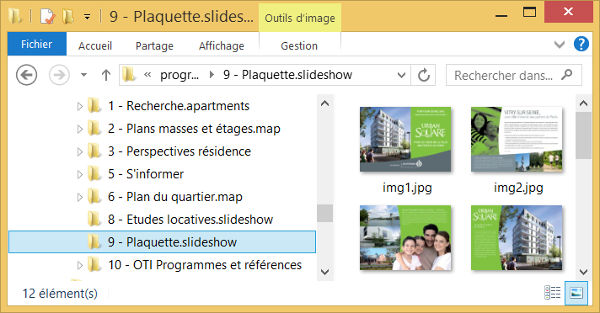
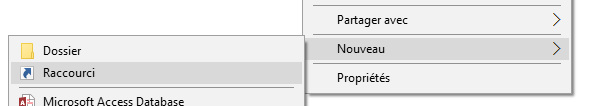
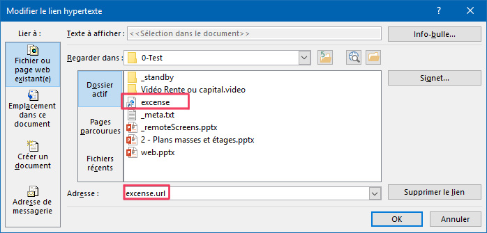

# Diaporama

Utilisez ce type de contenu pour afficher un diaporama d'images, une présentation PDF ou Powerpoint.

## Utilisation

Vous pouvez :

- Passer à la diapositive précédente ou suivante à l'aide des flèches `<` et `>`
- Aller directement à une diapositive à l'aide du bouton `diapositives` du menu
- Ouvrir un contenu associé
- Annoter
- Imprimer

## Administration

Vous pouvez construire un diaporama à partir d'un unique document aux formats PDF ou Powerpoint, à partir d'une suite d'images ou une combinaison de ces documents.

### Documents Powerpoint & PDF

- Extension de fichier : `ppt`, `pptx`, `pdf`

*Remarque 1 : certains documents complexes peuvent ne pas s'afficher correctement. Vous pouvez changer de format (par exemple enregistrer un Powerpoint en PDF) pour contourner le problème rencontré.*

*Remarque 2 : Les animations et diapositives interactives ne sont pas jouées par le Compositeur Digital : chaque diapositive est fixe. Vous pouvez cependant ajouter des "boutons" tactiles pour ouvrir un autre document (voir rubrique `Interactivité` plus loin sur cette page)*

### Dossier d'images

- Extension de dossier : `slideshow`, `ppt`, `pptx`, `pdf`
- Extension de fichier dans le dossier : `jpg`, `png`

Exemple d'arborescence :

### Dossier de documents

Vous pouvez créer un unique diaporama à partir de plusieurs documents Powerpoint ou PDF, et images. Placez l'ensemble des documents dans un même dossier de type

Exemple d'arborescence :

Dans le cas ci-dessus, le diaporama final affichera dans l'ordre la première image, les diapositives des 2 documents PDF puis la dernière image.

###  Interactivité

Vous pouvez créer une zone tactile sur une diapositive pour ouvrir un autre contenu : une vidéo, une autre présentation, etc.

1. Ouvrez votre présentation avec Microsoft PowerPoint.
2. Sélectionnez l'image ou l'objet sur lequel vous souhaitez créer un lien. Il est conseillé de choisir un élément qui invite l'utilisateur à le toucher pour déclencher l'ouverture du contenu.
	Attention : l'opération ne fonctionnera pas si vous sélectionnez le texte contenu dans une forme, c'est la forme elle-même qu'il faut sélectionner.
3. Allez dans l'onglet `INSERTION` de PowerPoint.
4. Cliquez sur le bouton `Lien hypertexte` du menu correspondant.
5. Dans la fenêtre qui apparaît, parcourez vos fichiers pour choisir le contenu que le lien devra ouvrir.
	Attention : vous devez obligatoirement choisir un contenu présent quelque part dans votre univers.
	Vous pouvez utiliser des [dossiers cachés](manage_contents#contentFolder) (extension de dossier `content`) s'ils ne doivent apparaître que dans le diaporama interactif.
	
6. Cliquez sur `Ouvrir`, puis sauvegardez votre présentation PowerPoint.

####  Interactivité - page web

Dans les cas où la zone tactile doit ouvrir une page web à l'intérieur du Compositeur Digital, la procédure est la suivante :

1. Créer un raccourci vers l'adresse de la page dans votre univers. 

2. Créer un lien hypertexte dans le Powerpoint comme pour les [zones tactiles](#interactive), à la différence qu'il faut saisir à la main le nom du fichier + ".url". Sinon Powerpoint tente de suivre le lien plutôt que de pointer sur le lien lui-même.

[Revenir au différents Types de contenus](content_types.md)
