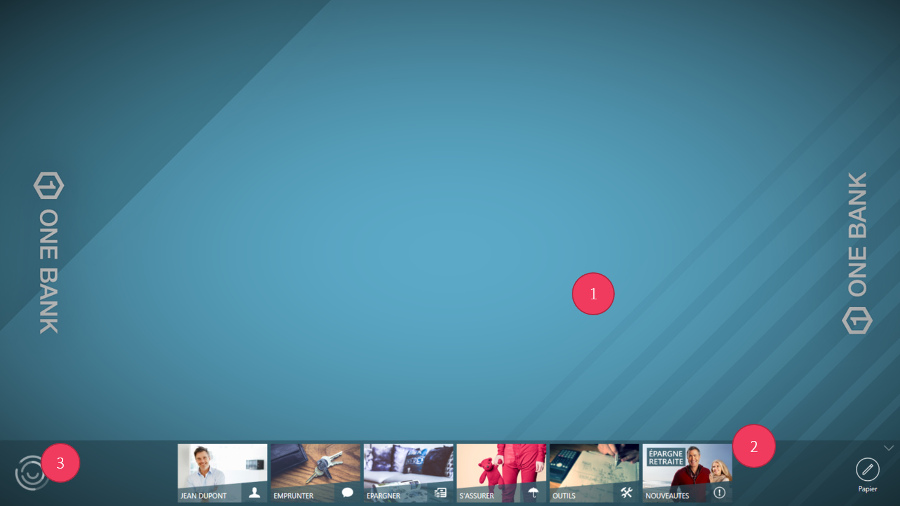
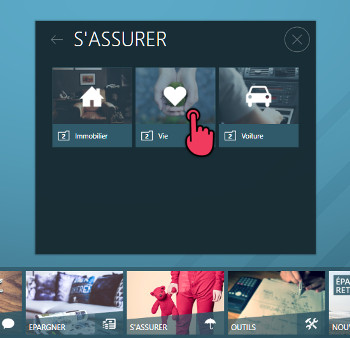
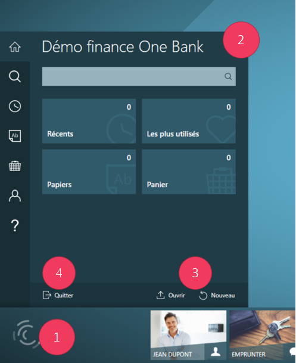
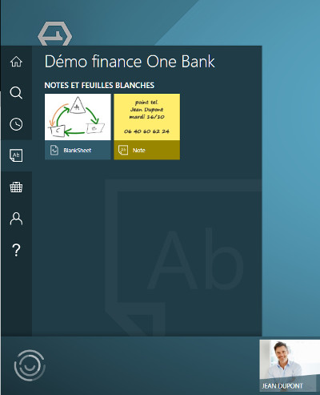
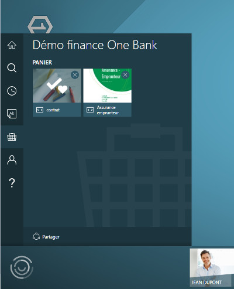
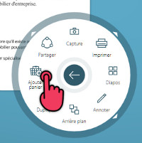
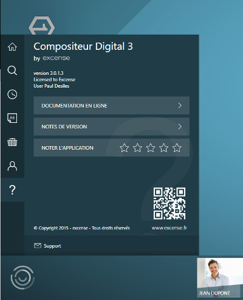

# Utilisation

## Présentation

L'interface utilisateurs est constituée de 2 parties :

1. Bureau collaboratif, sur lequel vous allez manipuler vos documents.
2. Barre de menu, pour piloter votre présentation.
3. Bouton de menu projet.

## Ouvrir un document

1. Dans la barre de menu, tapez sur la rubrique contenant le document;
2. Dans la rubrique ouverte, tapez sur le document désiré. Le document s'affiche alors.

## Manipuler un document

Vous pouvez effectuer les gestes suivants :

Déplacer 

Agrandir 

Tourner 

Pour fermer un document, utilisez le bouton en haut à droite :

Vous pouvez accéder à des actions supplémentaires (annotations, impression, etc.) à travers le bouton situé en bas à droite de chaque document :

## Gérer un projet

Le Compositeur Digital enregistre l'activité de votre espace d'échange (documents ouverts, annotations, profil utilisateur) et vous permet de gérer ces information sous forme de projets.
Pour créer un nouveau projet vous pouvez nommer votre session d'utilisation courante.

1. Ouvrez le menu projet.
2. Le nom du projet courant est affiché en haut du menu. Appuyez sur le nom pour le renommer et ainsi pouvoir retrouver ultérieurement ce projet.

3. Les boutons `Ouvrir` et `Nouveau` permettent respectivement de charger un projet existant et de créer un nouveau projet.
4. Le bouton `Quitter` permet de fermer l'univers courant et de revenir à la page d'accueil

## Rechercher des documents

1. Dans le menu projet, saisissez directement votre terme de recherche dans le cadre prévu à cet effet.
2. Les documents apparaissent au fur et à mesure. Vous pouvez alors les ouvrir directement en appuyant dessus.

## Documents récents et fréquemment utilisés

Cet onglet vous permet d'accéder à tous les documents déjà ouverts. Vous pouvez les trier soit suivant leur date de dernière ouverture en appuyant sur `Récents`, soit suivant leur fréquence d'utilisation en appuyant sur `Les plus utilisés`.

## Notes et Feuilles blanches

Cet onglet vous permet d'accéder à toutes les notes et feuilles blanches créées.

## Panier

Le panier est un espace permettant de regrouper des documents qui vous intéressent au même endroit.
Le bouton `partager` vous permet de partager en même temps l'ensemble de ces documents sur une clé usb ou par mail.

Pour ajouter un document au panier, ouvrez le menu du document et appuyez sur `ajouter panier`.

Pour enlever un document du panier, appuyez sur `suppr. panier` dans ce même menu, ou appuyez sur la croix en haut à droite du document dans le panier.

## Profil

L'onglet Profil regroupe un ensemble de données concernant votre interlocuteur. Une fois ces données renseignées, elles seront réutilisées automatiquement par le compositeur digital. Pour modifier un champ, appuyez sur sa valeur. 
Ainsi le champ `adresse email` sera utilisé comme destinataire dès que vous voudrez partager un document par mail, le champ `Budget` permettra de positionner le montant du crédit dans un simulateur de prêt...

## Infos

Le dernier onglet du menu permet d'accéder à des informations générales sur le logiciel. Vous pourrez également accéder à cette documentation ou nous donner votre avis sur le compositeur digital.
Appuyez sur le bouton `support` pour envoyer un mail au support technique d'excense : si vous rencontrez une anomalie ou un problème dans votre utilisation du logiciel, décrivez nous la situation dans ce mail.

Vous pouvez maintenant consulter la rubrique sur la [gestion des contenus](manage_contents.md).