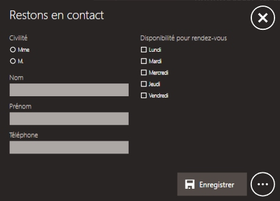
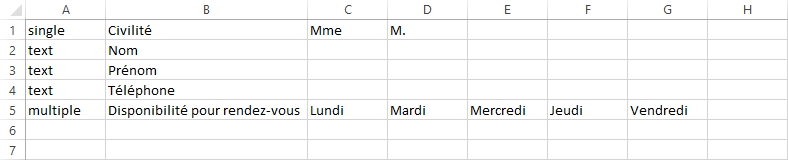

# Formulaire

Utilisez ce type de contenu pour proposer un questionnaire simple à vos clients et garder la trace de toutes les réponses.

## Utilisation

Vous pouvez :
- remplir les champs de texte à l'aide d'un clavier physique ou du clavier virtuel
- cocher/décocher les cases des questions à choix multiple
- appuyer sur le bouton `Enregistrer` pour enregistrer les informations renseignées et vider le formulaire

## Administration

- Extension de dossier : `form`
- Fichier image optionnel '_background' permettant de personnaliser le fond du questionnaire
- Fichier de paramétrage à l'intérieur du dossier : `_questions.csv`

Ce dernier document est au format CSV (avec séparateur `;`) : vous pouvez utiliser un tableur comme Microsoft Excel pour l'éditer.
Il contient les questions qui seront affichées dans le formulaire. Chaque ligne correspond à une question.

Voici le fichier qui permet d'obtenir le formulaire de l'aperçu précédent :

### Format des lignes du tableau :

- 1ère case : type de question
- 2ème case : intitulé de la question
- les cases suivantes : réponses possibles pour les questions à choix multiple

### Types de questions

- `text` : une réponse libre est attendue (dans le champ de texte associé)
- `single` : un seul choix possible parmi les réponses
- `multiple` : plusieurs choix possibles parmi les réponses

### Résultats
Vous pouvez consulter les résultats du formulaire dans le dossier `Mes Documents \ Compositeur Digital Formulaire`.	
Les fichiers de résultats sont nommés selon leur origine (nom de la déclinaison, arborescence éventuelle, puis nom du formulaire). 
Lorsque vous modifiez le fichier `_questionss.csv` et si les questions ont changé, les enregistrements de résultats se feront dans un nouveau fichier (ajout d'un numéro au nom du fichier) afin de ne pas écraser les anciens résultats.
Une nouvelle ligne de résultat est enregistrée à chaque fois que l'on appuie sur le bouton `Enregistrer`.

 
[Revenir au différents Types de contenus](content_types.md)