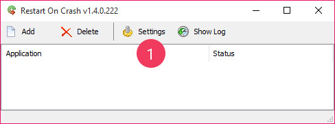
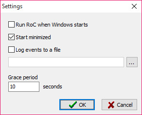
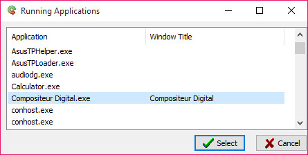
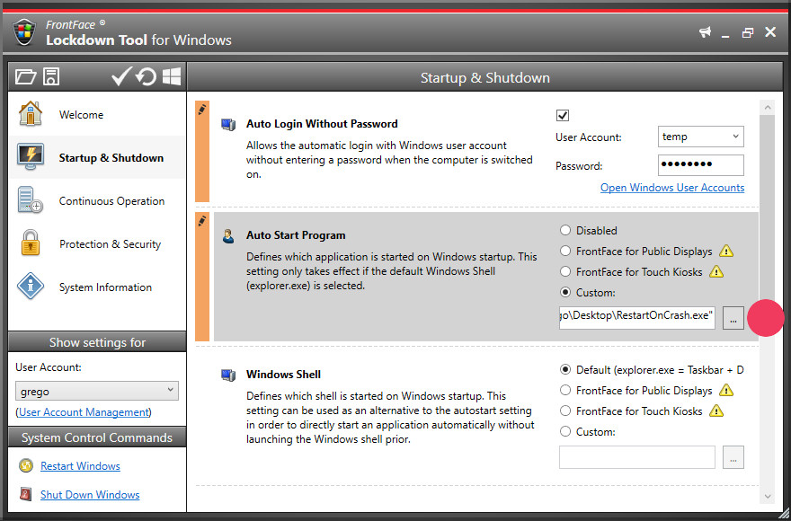
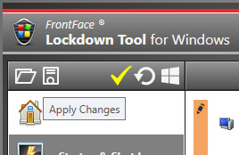

# Mode kiosque

Cette page décrit les étapes à suivre pour configurer le Compositeur Digital et son environnement logiciel en mode kiosque. 
Le mode kiosque est adapté à une utilisation du Compositeur Digital en libre accès au public.

Pour passer en mode kiosque, il faut configurer le Compositeur Digital, 
et optionnellement configurer une application annexe pour s'assurer que 
le Compositeur Digital fonctionne en permanence. 
Dans le cas d'une utilisation sous Windows 8/8.1 il est également souhaitable 
de désactiver les gestes d'activation de la barre des charmes en bord d'écran.

## Configuration du Compositeur Digital

Configurer le compositeur digital en mode kiosque active les fonctions suivantes :
* Réinitialisation des contenus après un temps d'inactivité.
* Vidéo de veille après un temps d'inactivité (optionnel).

Pour activer le mode kiosque :

1. Lancer le Compositeur Digital
2. Appuyer sur `F5` ou toucher le bouton `Paramètres` en bas à droite de l'écran
3. Dans l'onglet `Personnalisation`, sélectionner `Libre-service (kiosque)`
4. Redémarrer le Compositeur Digital

Pour définir une vidéo de veille, ajouter une vidéo nommée `_standby` à la racine de la déclinaison.

## Exécution continue

1. Télécharger [RestartOnCrash](http://1.shadowcdn.com/files/RestartOnCrash-v1.4.zip) et l'enregistrer sur l'ordinateur (ex: sur le bureau).
2. Lancer l'application et ouvrir le menu `Settings`

    

3. Effectuer les réglages suivants :

    

4. **Lancer le Compositeur Digital** puis ouvrir le menu `Add`

    

5. Cliquer `Select a running application` puis sélectionner le Compositeur Digital dans la liste.

    

6. Modifier les réglages comme suit - Dans le champs `Working directory` reprendre le contenu du champs précédent en retirant les guillemets et `Compositeur Digital.exe` à la fin.

    

## Mode kiosque et Windows 8/8.1

**Attention :** Le Compositeur Digital et RestartOnCrash doivent être configurés et en état de fonctionner avant de réaliser les opérations suivantes. 

1. Télécharger [FrontFace Lockdown Tool](http://download.mirabyte.com/Lockdown.exe).
2. Lancer l'application et se rendre dans l'onglet `Startup & Shutdown`.
3. Sélectionner le compte utilisateur courant et saisir le mot de passe.

    

3. Dans la section `Auto Start Program` sélectionner `Custom` et indiquer RestartOnCrash sur l'ordinateur.

    

4. Cliquer sur l'icône `Apply Changes`.

    

5. L'ordinateur va redémarrer. Après redémarrage, RestartOnCrash sera lancé, qui lancera à son tour le Compositeur Digital, le tout sans barre des tâches, bureau ou écran d'accueil.
Pour reprendre la main sur le système il sera nécessaire de brancher un clavier de taper la combinaison de de touches `Ctrl-Alt-Suppr` ou `Ctrl-Maj-Echap` pour accéder au gestionnaire de tâches.

[Revenir au menu](home.md)