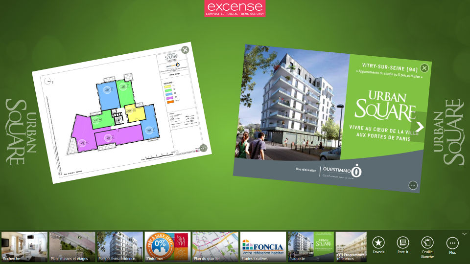
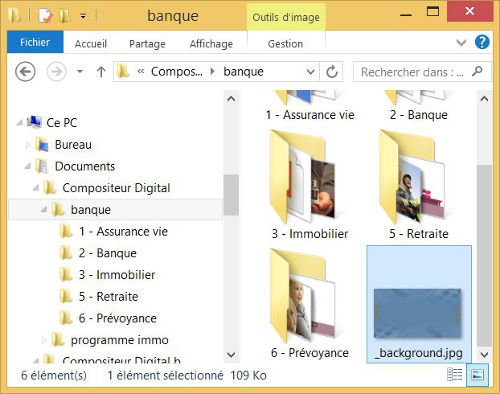
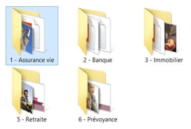
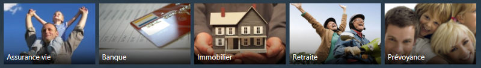
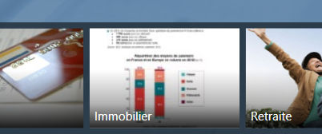

# Gérer les contenus

Le Compositeur Digital exploite un ensemble de documents que vous préparez à l'avance. Ces documents se trouvent sur votre ordinateur sous la forme de fichiers organisés en dossiers.

## Connaissances requises

La préparation s'effectue à travers l'explorateur de fichiers.

Vous devez maîtriser les actions suivantes :

- Naviguer dans une arborescence de dossiers à travers l'explorateur de fichiers de Microsoft Windows.
- Manipuler des fichiers : déplacer, renommer, supprimer, copier, coller.

### Extension

Sous Microsoft Windows, les fichiers sont représentés par leur nom auquel est associée une *extension*, généralement composée de 3 ou 4 lettres située après un point. L'extension détermine le type de document contenu dans le fichier. Quelques exemples :

- Images : photo1.jpg, photo2.png
- Présentation : pres1.pptx, pres2.pdf
- Fichier texte : sommaire.txt

Par défaut, l'explorateur de fichiers masque les extensions, nous vous conseillons fortement de changer ce comportement :

## Univers

Vous pouvez créer plusieurs univers : vous regroupez tous les documents d'une même présentation (réunion, rencontre client, etc.) dans un univers. Exemples :

Projet immobilier 

Services d'une banque

A chaque univers correspond un dossier sur votre ordinateur. Par défaut, le Compositeur Digital cherche ces dossiers dans `Documents\Compositeur Digital` :

Pour créer un nouvel univers, dupliquez un dossier d'univers existant ou créez un nouveau dossier dans `Documents\Compositeur Digital`.

## Fond d'écran

Pour personnaliser le fond d'écran par défaut du Compositeur Digital, ajoutez un fichier image nommé `_background` dans le dossier de l'univers :

## Dossiers

Dans un univers, organisez vos documents en dossiers et sous-dossiers.

Le premier niveau de dossier correspond aux rubriques accessibles dans la barre de menu du Compositeur Digital :

###  Dossiers cachés

Les dossiers ayant l'extension '.content' ne seront pas visibles dans le Compositeur Digital. 
Leur contenu reste par contre référençable,
par un [diaporama interactif](slideshow#interactive) par exemple.

## Documents

Ajoutez vos documents dans les dossiers de votre univers.

Consultez la rubrique [Types de contenus](content_types.md) pour la liste complète des formats supportés.

## Ordre d'affichage

Par défaut, le Compositeur Digital affiche les dossiers dans l'ordre alphabétique. Vous pouvez forcer un ordre particulier en préfixant à l'aide d'un numéro les noms des fichiers ou dossiers, les numéros n'apparaîtront pas dans le Compositeur Digital.

## Vignettes 

Par défaut, le Compositeur Digital tente d'afficher une vignette correspondant aux documents : vous pouvez personnaliser la vignette d'un document ou d'un dossier.

### Vignette de dossier

Exemple de dossier sans vignette, le Compositeur Digital utilise la première page du premier document dans le dossier :

 

Ajoutez un fichier image nommé `_preview` (format png ou jpg) dans le dossier :

 

### Vignette de document

Pour personnaliser la vignette d'un document, placez un fichier image avec le même nom que le document, suffixé avec `_preview` :

Rendez-vous à la rubrique [Types de contenus](content_types.md) pour connaître les spécificités des différents contenus pris en charge.

## Ecran de veille vidéo 

En mode kiosque il est possible de définir un écran de veille vidéo qui s'affichera en plein écran après une période d'inactivité.

Ajoutez un fichier vidéo nommé `_standby` dans le dossier de l'univers :

 

Rendez-vous à la rubrique [types de contenus vidéo](video.md) pour connaître les différents types de vidéos que vous pouvez utiliser pour l'écran de veille.
