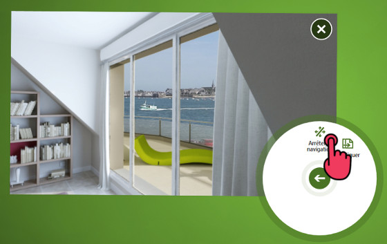

# Panorama 3D

Utilisez ce type de contenu pour afficher un point de vue panoramique d'un paysage ou de l'intérieur d'un bâtiment.

## Utilisation

Vous pouvez :
- Appuyer sur le bouton central pour activer la navigation 

- Orienter la vue en glissant votre doigt sur le document
- Déplacer/Zoomer le document sans désactiver la navigation en utilisant 2 doigts
- Désactiver la navigation à l'aide du bouton présent dans le menu, afin de revenir à la manipulation "classique" des documents

## Administration

- Extension de dossier : `panorama`
- Extension de fichier dans le dossier : `jpg`, `png`
- Une seule image est supportée à l'intérieur du dossier. Elle doit être issue d'une projection sphérique de la scène. 
- L'angle de vue par défaut est de 110. Pour le modifier vous devez renseigner la valeur de la meta "panorama.FieldOfView" : le fonctionnement des meta est décrit dans la section [Configuration avancée](config.md).

[Revenir au différents Types de contenus](content_types.md)