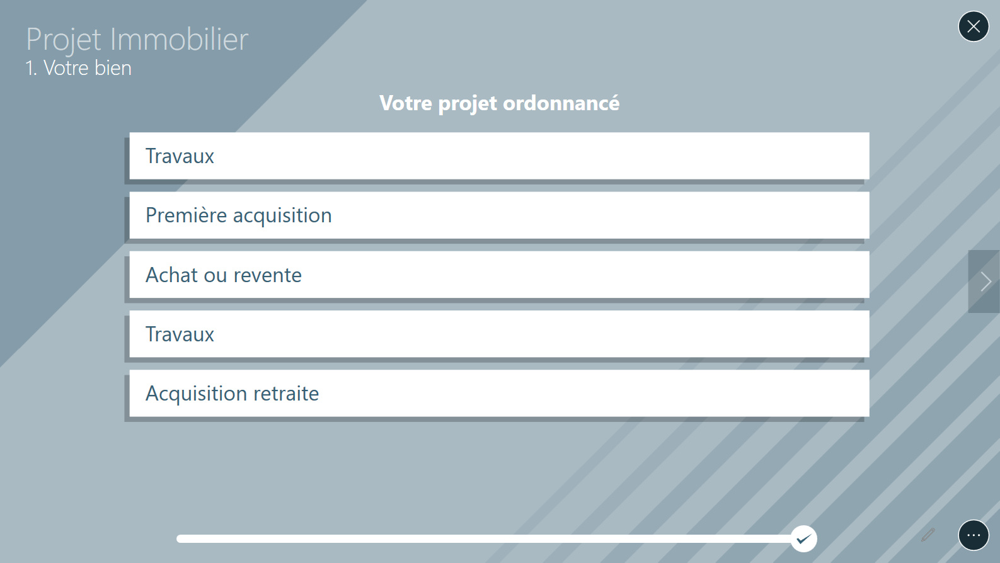

# Quiz

Utilisez ce type de contenu pour proposer un questionnaire simple à vos clients et garder la trace de toutes les réponses.

## Utilisation
Vous pouvez naviguer entre les différentes pages du quiz à l'aide des flèches `<` et `>`
En fonction des différentes pages sur lesquels vous êtes, vous pouvez également :
 - sélectionner ou désélectionner une réponse
 - déplacer un curseur
 - remplir des champs texte
 - ouvrir un document associé

## Administration

- Extension de dossier : `quiz` ou `quizz`
- Fichier image optionnel `_background` permettant de personnaliser le fond du quiz
- Les éventuels documents que l'on souhaitera ouvrir depuis le quiz
- Un dossier `_meta` contenants les images utilisées dans le quiz
- Fichier de paramétrage  : `_questions.xml`

Ce dernier document est au format XML : vous pouvez par exemple utiliser le Bloc-notes de windows pour l'ouvrir. Il contient le détail des pages du quiz.

### Le format XML

Ce format permet de présenter des éléments sous forme hiérarchisée : un élément peut contenir d'autres éléments qui eux même peuvent en contenir d'autres.
Chaque élément s'écrit avec des `balises` :
 - soit avec une balise unique : 
   ```xml
   <nomDeMonElement />
   ```
 - soit avec une balise ouvrante puis une balise fermante : 
   ```xml
   <nomDeMonElement> </nomDeMonElement>
   ```

 La deuxième écriture permet de renseigner le contenu de l'élément, en le plaçant entre la balise ouvrante et la balise fermante. Ce contenu peut être : 
  - un simple texte :
    ```xml
    <element>contenu de mon élément</element>
    ```
  - ou une liste d'autres éléments :
    ```xml
	<elementPere>
	    <elementFils1 />
	    <elementFils2 />
	    <elementFils3 />
	</elementPere>
    ```

Chaque élément peut contenir des `attributs` permettant de modifier ses paramètres. On les écrit comme ceci : `nomDeMonAttribut="maValeur"` et on les place à l'intérieur de la balise ouvrante (ou de la balise unique), après le nom de l'élément :
```xml
<element nomDeMonAttribut="maValeur" />
```
```xml
<element nomDeMonAttribut="maValeur" > </element>
```

### Organisation du fichier de paramétrage

Tout le contenu du document se trouve à l'intérieur d'une balise `quizz`. Celle-ci contient deux éléments : `sections` et `pages`, contenant respectivement la liste des sections et la liste des pages.
Organisation générale du fichier :
```xml
<quizz>
    <sections>
        liste des sections
    </sections>
    <pages>
        liste des pages
    </pages>
</quizz>
```

Les pages correspondent aux écrans qui pourront s'afficher dans le quiz. Les sections permettent de regrouper des pages sous un même nom. 

### Les Sections

Le nom d'une section doit être placé en tant que contenu, entre la balise ouvrante et la fermante. C'est cette valeur qui sera affichée dans le quiz sur la page de cette section.
Une section possède un attribut nommé `id` qui permettra de faire une référence à cette section. C'est sont identifiant. Cette valeur ne sera jamais affichée mais juste utilisée pour lier des pages à cette section.

exemple :
```xml
<section id="intro">1. INTRODUCTION</section>
```

### Les Pages
Ils existe différents types de pages que vous pourrez afficher dans le quiz en fonctions de vos besoins, mais elles possèdent des propriétés communes :
 - un attribut `sectionId` : cet attribut permet d'associer la page à une section, en utilisant la même valeur que celle renseignée dans l'attribut id de la section. Il est fortement conseillé de spécifier la section sur chaque page afin de garantir un comportement cohérent de la barre de progression.
 - un attribut `id` : tout comme les sections, on peut donner un identifiant à une page pour pouvoir y faire référence. Si vous n'avez pas besoin de faire référence à une page, il n'est donc pas nécessaire de renseigner cet attribut pour cette page.
 - un attribut `nextPageId` : il permet d'indiquer quelle page devra suivre celle-ci, en utilisant la même valeur que celle renseignée dans l'attribut id de la page. Cet attribut est facultatif : par défaut le quiz suivra l'ordre dans lequel sont écrites les pages dans le fichier.

### Début et fin
La première page qui sera affichée dans le quiz sera la première de la liste des pages.
Par défaut, la dernière page de la liste sera également la dernière à pouvoir être affichée, cependant il est possible d'avoir plusieurs pages de fin en fonction des réponses choisies aux questions.
Pour indiquer qu'une page termine le quiz il suffit de renseigner son attribut `nextPageId` avec la valeur spécifique `@end`.

### Les différents types de page
#### Le Type `questionPage`
Ce type permet d'afficher une question (un texte ou une image) et une liste de réponses possibles (textes ou images). Ce n'est qu'une fois une réponse sélectionnée que l'on pourra passer à la page suivante.
Il possède 3 attributs possibles :
 - `label` : la question textuelle à afficher. Si cet attribut est renseigné l'attribut visual ne sera pas utilisé.
 - `visual` : le nom de l'image à afficher en tant que question (sans son extension). Celle-ci doit être placée dans le dossier `_meta` du quiz
 - `allowMultiple` : cet attribut facultatif permet d'autoriser la sélection de plusieurs réponses quand il a pour valeur `true`. La valeur est `false` par défaut.

Une `questionPage` prend en contenu la liste de réponses possible. Ces réponses peuvent être de deux types :
 - des `answer`, des réponses textuelles qui prennent en contenu le texte de la réponse :
   ```xml
   <answer>ma réponse</answer>
   ```
 - des `imageAnswer`, des réponses images. On spécifie le nom de l'image à utiliser (celle-ci devra être dans le dossier `_meta` du quiz) dans l'attribut `visual` :
   ```xml
   <imageAnswer visual="image 2"/>
   ```
   Si besoin, on pourra afficher un texte en bas de l'image en plaçant ce texte en tant que contenu de l'élément :
   ```xml
   <imageAnswer visual="image 2">ma légende</imageAnswer>
   ```

Il n'est pas possible de mélanger des réponses de type texte à des réponses de type image dans une même question.

Afin de pouvoir adapter le quiz à l'utilisateur, il est possible de spécifier des parcours différents en fonction de la réponse sélectionnée. Il faut pour cela spécifier l'attribut `nextPageId` sur la réponse, en l'utilisant de la même manière que l'attribut `nextPageId` d'une page : en mettant en valeur l' `id` de la page qui doit suivre.

exemples :
```xml
<questionPage sectionId="section 2" label="A quelle question voulez-vous répondre ensuite ?">
	<answer>la question suivante</answer>
	<answer nextPageId="question A">la question A</answer>
	<answer nextPageId="question B">la question B</answer>
</questionPage>

<questionPage id="B1" sectionId="section 3" label="Nature du bien">
	<imageAnswer visual="maison">  
	<imageAnswer visual="appartement" />
	<imageAnswer visual="terrain seul">Terrain seul</imageAnswer>
	<imageAnswer visual="construction seule">Construction seule</imageAnswer>
	<imageAnswer visual="terrain et construction">Terrain et construction</imageAnswer>

</questionPage>
```


#### Le Type `page`
Ce type de page très simple permet d'afficher un titre ou une image. Pour cela remplissez l'un des 2 attributs suivants :
 - `label` : le titre à afficher
 - `visual` : le nom de l'image à afficher (sans son extension). Celle-ci doit être placée dans le dossier `_meta` du quiz

 exemple :
```xml
<page sectionId="intro" label="Ceci est un test"/>
```


#### Le Type `infoPage`
Ce type de page permet d'afficher un petit formulaire pour récupérer quelques informations simples sur la personne répondant au quiz.
Il est possède d'un attribut facultatif `label` qui permet d'afficher un texte ou une question au-dessus du formulaire.
Pour chaque champ texte que vous souhaitez afficher vous devez ajouter dans le contenu de cette page un élément `info`, en précisant son attribut `label` pour indiquer le nom du champ.

exemple :
```xml
<infoPage sectionId="intro" label="Veuillez renseigner les informations suivantes">
	<info label="Nom"/>
	<info label="Prénom"/>
</infoPage>
```


Afin de partager une donnée avec d'autres documents, vous pouvez utiliser l'attribut `valueKey` pour chaque élément `info` (voir [données partagées](config#valueKeys)).


#### Le Type `numericSliderPage`
Ce type de page permet d'afficher un curseur à valeur numérique. Vous pouvez le paramétrer à l'aide des attributs suivants :
 - `label` : le titre ou la question à afficher.
 - `visual` : le nom de l'image à afficher en tant que question (sans son extension). Celle-ci doit être placée dans le dossier `_meta` du quiz
 - `min` : la valeur minimale sélectionnable
 - `max` : la valeur maximale sélectionnable
 - `minLabel` : (optionnel) : valeur affichée pour la valeur minimale
 - `maxLabel` : (optionnel) : valeur affichée pour la valeur maximale
 - `default` : (optionnel) la valeur sélectionnée par défaut au chargement de la page
 - `stepSize` : le "pas" de sélection (différence minimale entre deux valeurs du curseur)
 - `format` : permet de changer la manière d'afficher la valeur.

 différentes valeurs possible pour format :
 - `N0` : un entier
 - `C0` : une valeur monétaire entière (sera suivi du symbole € sur un ordinateur français, précédé par un £ sur un ordinateur anglais, etc.)

exemple :
```xml
<numericSliderPage id="apport" sectionId="section 3" label="Votre budget " min="0" max="1000000" stepSize="5000" format="C0" valueKey="finance.budget" />
```


Afin de partager la valeur du curseur avec d'autres documents, vous pouvez ajouter un attribut `valueKey` à cette page (voir [données partagées](config#valueKeys)).

#### Le Type `labelSliderPage`
Ce type de page permet d'afficher un curseur avec du texte. Vous pouvez le paramétrer à l'aide des attributs suivants :
- `label` : le titre ou la question à afficher.

Possibilité de gérer les étapes disponibles en rajoutant des `answer`. La première va définir le minimum et la dernière le maximum.
Les réponses proposées doivent donc être classés en ordre croissant (lorsque c'est possible).

exemple :
```xml
<labelSliderPage sectionId="section1" label="Faites vous souvent des achats en ligne ?">
	<answer>Jamais</answer>
	<answer>Parfois</answer>
	<answer>Souvent</answer>
	<answer>Toujours</answer>
</labelSliderPage>
```


#### Le Type `imageSliderPage`
Ce type de page permet d'afficher un curseur à valeur relative entre deux images : la valeur n'est pas affichée; l'utilisateur choisi juste si il est plus en accord avec l'image de droite ou l'image de gauche en déplaçant le curseur.
Vous pouvez le paramétrer à l'aide des attributs suivants :
 - `label` : le titre ou la question à afficher.
 - `visual` : le nom de l'image à afficher en tant que question (sans son extension). Celle-ci doit être placée dans le dossier `_meta` du quiz
 - `leftVisual` : l'image qui sera affichée à gauche du curseur
 - `rightVisual` : l'image qui sera affichée à droite du curseur
 - `stepQuantity` : le nombre de valeur sélectionnables sur le curseur (une valeur de 10 est conseillée pour meilleur rendu visuel)

exemple :
```xml
<imageSliderPage sectionId="partie 1" label="Vous êtes plutôt :" leftVisual="image1" rightVisual="image2" stepQuantity="10"/>
```


#### Le Type `documentPage`
Cette page permet de lancer l'ouverture d'un document dans le Compositeur Digital.
Vous pouvez le paramétrer avec les attributs :
- `label` : le titre ou la question à afficher.
- `document` : le nom du document à ouvrir. Il faut que le document soit dans le dossier du quiz.

exemple :
```xml
<documentPage label="Vos documents :" document="Documents A"/>
```


#### Le Type `orderPage`
Cette page permet de définir un nombre de réponse minimum dans un questionnaire et de récupérer celles qui sont cochées.
Vous pouvez le paramétrer avec les attributs :
- `label` : le titre ou la question à afficher.
- `answerNumber` : le nombre de réponse minimum à cocher.
- `imageAnswer` : ajoute une image comme réponse.
- `visual` : ajoute une visuel comme réponse.
- `visualChecked` : image remplaçant le visuel lorsqu'il est sélectionné.

exemple :
```xml
<orderPage sectionId="section 1" label="Votre projet ordonnancé" answerNumber="3">
	<answer >Travaux</answer>
    <answer >Première acquisition</answer>
	<answer nextPageId="tousLesBiens">Achat ou revente</answer>
    <answer nextPageId="maisonAppart">Travaux</answer>
    <answer nextPageId="tousLesBiens">Acquisition retraite</answer>
</orderPage>
```


ou


```xml
<orderPage sectionId="section 1" label="Votre projet ordonnancé" answerNumber="3">
	<visualAnswer visual="maison" visualChecked="test1">Maison</visualAnswer>
    <visualAnswer visual="appartement" visualChecked="test2">Appartement</visualAnswer>
  </orderPage>
```


### Résultats
Vous pouvez consulter les résultats du quiz dans le dossier `Mes Documents \ Compositeur Digital Quiz`.	
Les fichiers de résultats sont nommés selon leur origine (nom de la déclinaison, arborescence éventuelle, puis nom du quiz). 
Lorsque vous modifiez le fichier `_questions.xml` et si les questions/titres de page ont changé, les enregistrements de résultats se feront dans un nouveau fichier (ajout d'un numéro au nom du fichier) afin de ne pas écraser les anciens résultats.
Une nouvelle ligne de résultat est enregistrée à chaque fois que l'on atteint une page de fin du quiz.


[Revenir au différents Types de contenus](content_types.md)
