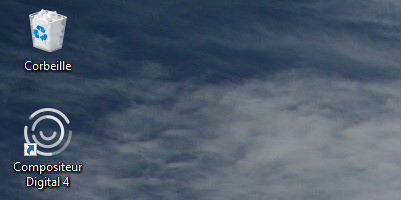
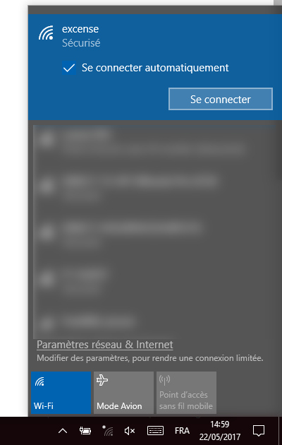
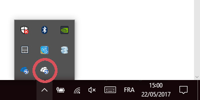
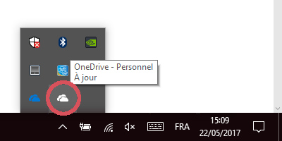

# Kaufman & Broad : guide d'utilisation du Compositeur Digital

Ce guide décrit comment utiliser le Compositeur Digital sur les tables, tablettes ou écran tactiles pour présenter les programmmes Kaufman & Broad.

## Lancer et utiliser le Compositeur Digital

- Si le Compositeur digital n'est pas déjà lancé, une icône Compositeur Digital doit se trouve sur le bureau :

- Pour l'utilisation du Compositeur Digital, référez-vous à la [documentation en ligne](use.md).

## Dépannage

### Lorsque j'accède à un programme, le Compositeur Digital indique "Préparation des contenus" pendant plusieurs minutes.

Pour offrir la meilleure réactivité en rendez-vous, l'application Compositeur Digital précharge les contenus de vos programmes immobiliers. Cette opération peut prendre plusieurs minutes uniquement lors du premier accès au programme immobilier. Par la suite, l'accès est quasi-instantané. Il est conseillé de charger le programme préalablement au premier rendez-vous client.

### Il manque un ou plusieurs programmes, ou le programme n'est pas complet.

Ce problème apparait si les contenus ne sont pas synchronisés ou ne le sont que partiellement. Dans ce cas, suivez les étapes suivantes pour résoudre le problème.

1. Quitter le Compositeur Digital s'il est en cours d'éxecution.
2. Verifier la connexion à internet dans la barre de tâches :

- Si la tablette ou l'écran est bien connecté(e), l'icône Wi-Fi apparait ainsi :

- Si la tablette ou l'écran n'est pas connecté(e), l'icône Wi-Fi apparait ainsi :

- Appuyez sur cet icône et sélectionez le réseau Wi-Fi de votre point de vente. (exemple ci-dessous avec le réseau Excense) 

3. Vérifiez la synchronisation OneDrive :
- Lorsque une synchronisation est en cours, l'icône suivant apparait :  

- Patientez jusqu'à ce que la synchronisation soit terminée. Lorsque celle-ci est terminée l'icône passe alors à l'état suivant :

- Redémarrez le Compositeur Digital. Tous les programmes doivent alors apparaître au complet.
